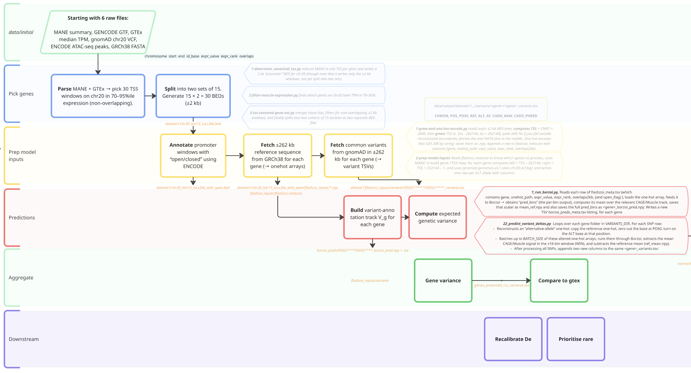

# seq2expr-variance
Goal is to use deep‐learning–based regulatory models to quantify how common cis‐variants (from gnomAD) shape gene expression variability—and to assess whether incorporating these “expected genetic variances” improves expression analyses (e.g. differential expression or variant prioritization).

## Data
1. ENCFF150TGS.bed: https://www.encodeproject.org/files/ENCFF150TGS/
• Open-chromatin peaks (skeletal-muscle ATAC-seq).
• Use: filter promoter windows to “open” vs “closed” in muscle.
2.	gencode.v47.basic.annotation.gtf
• GENCODE v47 basic gene models (GRCh38).
• Use: list all gene TSSs; extract transcript exon/intron coordinates.
3.	gnomad.genomes.v4.1.sites.chr20.vcf.bgz + .tbi
• gnomAD v4.1 variant calls on chr 20.
• Use: fetching common variants in each gene’s ±262 kb window.
4.	GTEx_Analysis_2022-06-06_v10_RNASeQCv2.4.2_gene_median_tpm.gct
• Median TPM by gene × tissue (GTEx v10).
• Use: select genes with moderate muscle‐skeletal expression (70–95 %).
5.	MANE.GRCh38.v1.4.summary.txt
• MANE Select canonical transcripts.
• Use: pick a single, high‐confidence TSS per gene.
6.	GRCh38.primary_assembly.genome.fa
• GRCh38 reference FASTA.
• Use: extract ±262 kb sequence windows for Flashzoi / Enformer input.

## References
- https://www.gtexportal.org/home/downloads/adult-gtex/bulk_tissue_expression: Median gene-level TPM by tissue. Median expression was calculated from the file GTEx_Analysis_v10_RNASeQCv2.4.2_gene_tpm.gct.gz
- CADD score: https://cadd.gs.washington.edu/snv
- Genome download: https://gnomad.broadinstitute.org/data#v4
- Matched Annotation from NCBI and EMBL-EBI (MANE): https://www.ncbi.nlm.nih.gov/refseq/MANE/
- Borzoi: https://github.com/johahi/borzoi-pytorch

